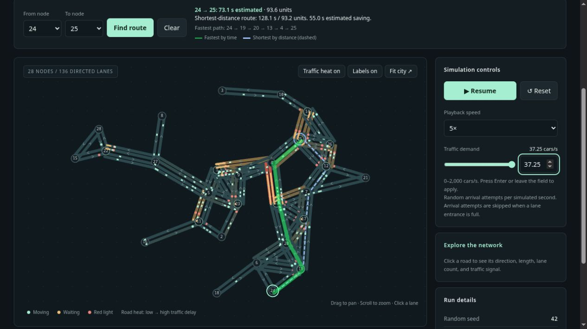

# STREETFLOW

A C++ traffic simulator controlled from the terminal, with an animated city view in your browser. The city is your directed graph: load a `CITY.IN` file, spawn cars, and watch traffic move through lanes and traffic lights.



## Start the app

After installation, open a new terminal and run:

```sh
streetflow
```

This loads `CITY.IN` from your current directory if one exists. Otherwise, it starts the bundled demo: 28 irregularly placed nodes and 136 directed lanes. The app opens **http://127.0.0.1:8080** in your browser. Keep the terminal running; **Ctrl+C** stops the simulation and server.

To load your own city:

```sh
streetflow /path/to/CITY.IN
```

Traffic demand can be set with the slider, which snaps to whole cars/s, or the number field beside it (0–2,000 cars/s, including decimals). Press Enter or leave the number field to apply it. For a custom decimal value, the slider thumb sits at the nearest whole number while the field and demand label keep your exact value.

Drivers give up after **60 simulated seconds of accumulated traffic delay** by default. They keep moving with the queue and despawn at the next node ahead. Run details shows the **Crashed out** count. Change the limit with `streetflow --max-wait 120`, or disable it with `--max-wait 0`.

The **Intersection queues** column on the left ranks nodes by stopped cars on their incoming roads, longest queue first (ties use node ID). Cars moving below 0.05 units/s count as stopped, matching **Waiting now**. Cars count at the next intersection, regardless of their final destination, and parallel incoming lanes are combined. Counts update live, include cars beyond the map’s display limit, and clear as queues move or the simulation resets. Nodes with no queue appear at the bottom.

Turn **Crashouts on** above the map to display `× N` badges on roads where drivers left before reaching their destination. Counts accumulate until Reset, combine parallel lanes in the same direction, and keep opposite directions separate. Unmarked roads have zero crashouts. Click a road to see both its total and the selected lane's count, even when the overlay is off. A driver who reaches their original destination counts as a completed trip.

The viewer provides moving cars, red/amber/green lights, lane inspection, pause/resume, reset, traffic demand, playback speed, trip statistics, a congestion overlay, and an A-to-B route comparison. Drag the map to pan, scroll to zoom, and click a lane for details. The simulator and the entire viewer are bundled into one executable; runtime operation needs no internet connection.

## Build and install

The current implementation targets **Linux**, using C++20 and POSIX sockets. You need a C++20 compiler, CMake 3.20 or newer, and a build tool such as Make or Ninja. There are no third-party C++ dependencies or JavaScript package installs.

From this repository:

```sh
cmake -S . -B build -DCMAKE_BUILD_TYPE=Release
cmake --build build --parallel
cmake --install build --prefix "$HOME/.local"
```

Or use the helper:

```sh
bash tools/install-user.sh
```

Make sure `~/.local/bin` is on your shell's `PATH`. If needed, add this line to `~/.bashrc`, then open a new terminal:

```sh
export PATH="$HOME/.local/bin:$PATH"
```

You can also run `./build/streetflow` directly. Rebuild and reinstall after changing the source. Sample city files are installed under `~/.local/share/streetflow/examples/`.

## Your `CITY.IN` format

Each line is **one directed lane**:

```text
a b c d
```

| Value | Meaning |
|---|---|
| `a` | Starting node ID |
| `b` | Ending node ID |
| `c` | Traffic light at the end of this lane: `0` = no, `1` = yes |
| `d` | Lane length in simulation units |

```text
1 5 0 10
5 1 0 10
1 2 1 15
1 2 1 15
```

- `1 5 0 10` creates a lane from node 1 to node 5, with no light and a length of 10.
- `5 1 0 10` adds travel in the opposite direction.
- Repeating `1 2 1 15` creates two parallel lanes from node 1 to node 2, both controlled by the same approach signal.

Nodes are inferred from edge endpoints; no node list or count header is needed. Node IDs can be any nonnegative integers and do not need to be consecutive. Blank lines and `#` comments are accepted. Lengths must be positive, and a lane must connect two different nodes. Parallel lanes are assumed to share their flag and length, as agreed when authoring the file.

A connection count uses **distinct neighbouring nodes**, so reverse edges and parallel lanes do not turn a corner into an intersection. A node with two neighbours is a corner/continuation; three or more is a junction. The graph alone does not identify which road is the main road, or the physical angle of a turn.

The light flag controls traffic **approaching `b` from `a`**. Set it on every incoming direction that should be signalized. A `0` approach remains unsignalized even if another approach to the same node has a light.

## Drawing the city

Your four-column format stays unchanged. When you start the app, it arranges the nodes **before the simulation clock starts**. Add a road containing a new node ID to `CITY.IN`, then restart STREETFLOW; its position is calculated from its connections. The bundled demo and automatically discovered `CITY.LAYOUT` files use their saved positions as starting hints and go through spacing correction.

The automatic layout uses road springs, node repulsion, and gradually decreasing movement so the graph settles into place. Parallel lanes and reverse roads form one spring per node pair, with spacing based on the widest bundle of lanes. A separation pass adds clearance between nodes and keeps unrelated nodes outside road corridors on small diagrams. Disconnected clusters are packed separately. Small graphs try three deterministic starting arrangements (plus the saved arrangement when available) and select the result with the best crossing/spacing score. Large graphs use a Barnes–Hut tree to approximate distant repulsion rather than comparing every pair of nodes. This is a drawing heuristic, not a guarantee of a globally perfect or crossing-free layout. Road crossings in the drawing create no additional graph connections.

To rearrange the whole city, including the bundled demo or a city with saved coordinates:

```sh
streetflow --auto-layout
streetflow /path/to/CITY.IN --auto-layout
```

Positions settle once at startup and stay still during traffic simulation. The same graph and starting hints produce the same automatic arrangement. Changing lane order or adding a reverse direction with matching road length and lane count does not change the geometry. Adding parallel lanes can require more clearance.

Click **Bigger numbers** above the map to enlarge node IDs; click **Normal numbers** to restore their size. Node circles grow to fit the text, and numbers are drawn above cars and route highlights so they stay readable.

For a custom arrangement, put a `CITY.LAYOUT` file beside your input file:

```text
# node_id x y
1 0 0
2 180 0
5 0 150
```

You can provide positions for all nodes or just some of them. By default they are hints that may move during spacing correction. To keep listed nodes fixed, pass `--layout FILE` explicitly; missing nodes are then placed around those fixed positions. Fixed coordinates can still overlap if authored that way. Coordinates affect the drawing only; `d` in `CITY.IN` determines travel distance. `--auto-layout` ignores saved coordinates and starts a fresh arrangement.

See [examples/CITY.IN](examples/CITY.IN) and [examples/CITY.LAYOUT](examples/CITY.LAYOUT) for the bundled city.

## How the simulation works

- **Time:** fixed 0.05-second steps. Playback speed changes the number of simulated seconds per wall-clock second, keeping the same step size.
- **Movement:** cars move at a configurable cruising speed, default **2 length units per simulated second**. An unobstructed 10-unit lane takes about 5 seconds. Transfers between lanes happen only when a car reaches the end; travel times are quantized to simulation steps.
- **Queues:** cars maintain at least **0.85 units** of front-to-front spacing on each lane. A car slows or stops behind the vehicle ahead and waits if its next lane has no entrance space. This is a simple constant-speed/instant-braking model.
- **Crashouts:** each car accumulates the time lost compared with cruising-speed travel, including queues and signal waits. At `--max-wait` seconds (default 60), it commits to leaving at the downstream end of its current lane. It still follows the queue and speed limit; it never disappears mid-road or reverses toward the previous node. Once at the node it exits the network without waiting for a green light, junction crossing slot, or downstream space. Exits before the original destination count as `abandoned` and do not contribute to completed-trip averages; arrivals at the original destination still count as completed. A limit of 0 disables crashouts. Reset clears the overall and per-road counts.
- **Random trips:** arrival attempts follow a Poisson process. A source with outgoing roads is selected, then a reachable destination. Time-dependent Dijkstra chooses the route with the earliest predicted arrival. Routes are chosen when cars spawn; existing cars keep their chosen route. Use `--routing distance` for the old distance-only baseline. Within a simulation step, at most 32 source trees are cached against the same traffic observation; they expire at the next step.
- **Lane choice:** parallel lanes form one road direction. Cars use an available lane with the shortest queue when entering it; they do not change lanes partway along a road.
- **Signals:** incoming signalized directions take turns. Each gets 8 seconds green, followed by 2 seconds amber and 1 second all-red by default. Amber stops new crossings. Parallel lanes from the same source share the phase.
- **Junctions:** one car crosses a node at a time, with a headway based on spacing and speed. Rotating priority decides between eligible approaches; a car cannot enter a full downstream lane. Turning geometry and simultaneous nonconflicting movements are not modeled yet.
- **Demand:** arrival attempts that hit the car limit or a full road entrance are counted as unadmitted arrivals. They are not held in an external queue.
- **Repeatability:** the same city, configuration, seed, and number of steps replay the same run with the same build/toolchain. Reset restarts the random sequence with the current demand settings.

Lengths are abstract units for now. Road size and speed must use a consistent scale. The current model is intended for traffic experiments; it has no calibrated vehicle dynamics, real road data, AI controller, or air-quality model yet.

## Fastest routes and congestion

In the viewer, choose **From node** and **To node**, then **Find route**. The green highlight is the fastest predicted route, drawn above vehicles at 50% opacity; the dashed blue line is the shortest-distance route. Both are evaluated against the same traffic observation and departure time. The route panel shows their distance, estimated journey time, node sequence, and estimated time saving. Route estimates refresh while the simulation runs; **Pause** freezes conditions for inspection.

The algorithm is **time-dependent Dijkstra with a queue-clearance forecast**. Each edge has an exit-time function rather than a fixed distance cost. For an estimated entry time `t`, the model:

1. Starts with `length / cruising_speed`.
2. Forecasts when cars already on that road reach its stop line and clear the signal, using vehicle spacing and the configured green windows. Parallel lanes share the simulator's junction crossing capacity.
3. Estimates when a blocked road entrance becomes available.
4. Finds the earliest departure through the light after both the new car and the current queue are ready.
5. Propagates that arrival time into the next road during the search.

Conceptually:

```text
exit(t) = next_green(max(max(t, entrance_available_at) + drive_time,
                        current_queue_cleared_at))
```

The exit function is nondecreasing: entering an edge later cannot produce an earlier exit under the same observation (the **FIFO property**). That supports Dijkstra's earliest-arrival search. The implementation uses a priority queue; each search costs approximately `O((V + E) log V)`, plus building the shared traffic forecast. Drawing coordinates are not used as travel distances.

**Congestion heat** represents additional predicted delay caused by traffic. For each road, the model also calculates the time with an empty road at the same departure time and light phase:

```text
traffic_delay = predicted_travel_time - empty_road_travel_time
heat = traffic_delay / (free_flow_drive_time + traffic_delay)
```

The heat ranges from 0 to 1; warmer roads have a larger traffic delay relative to their driving time. A red light on an empty road is not by itself counted as congestion. Click a lane to see estimated travel time, traffic delay, signal delay, and road space occupied. Parallel lanes display the forecast for their shared approach.

**Limits:** this is a forecast from current vehicles and known signals. It does not predict future arrivals or crashouts, reroute cars mid-trip, or fully forecast interference between different approaches and downstream gridlock. Departed cars are removed from the next traffic observation. A longer route may have the better ETA, but actual journey time can still change. Displayed savings are model estimates, not measured improvements. Do not interpret the heat scale as a calibrated real-world congestion index.

Research informing this design:

- [Ding, Yu & Qin: Finding Time-Dependent Shortest Paths over Large Graphs](https://www.microsoft.com/en-us/research/wp-content/uploads/2016/02/edbt08tdsp.pdf) explains time-dependent edge delays and FIFO routing. STREETFLOW uses a fixed-departure earliest-arrival search, not the paper's full departure-window optimization.
- [FHWA Traffic Signal Timing Manual, chapter 3](https://ops.fhwa.dot.gov/publications/fhwahop08024/chapter3.htm) discusses queue discharge, headways, green time, and control delay. STREETFLOW's forecast is a simplified model of its own simulation rules, not a full implementation of the Highway Capacity Manual.

## Useful commands

```sh
# See every option
streetflow --help

# Check an input file without starting the app
streetflow examples/CITY.IN --validate

# Start paused, without opening another browser window
streetflow --paused --no-browser

# Automatically arrange all nodes before starting
streetflow --auto-layout

# Change traffic, cruising speed, and signal timing
streetflow examples/CITY.IN --spawn-rate 8 --speed 2 --green 12 --yellow 2 --all-red 1

# Let drivers tolerate two minutes of accumulated delay before leaving
streetflow --max-wait 120

# Show the fastest and shortest routes between two nodes
streetflow --route 24 25

# Compare against distance-based routing for newly spawned cars
streetflow --routing distance

# Use another port when 8080 is busy
streetflow --port 8081

# Run 10 simulated minutes as fast as possible, without the viewer
streetflow examples/CITY.IN --headless --duration 600 --seed 42
```

Headless mode prints a JSON summary to standard output and execution time to standard error. With `--route A B`, it also prints a second JSON record comparing routes at the end of the run. `--duration` is rounded up to a full simulation step. It ignores browser playback controls and runs until the requested duration or Ctrl+C.

| Statistic | Meaning |
|---|---|
| `active` | Cars currently in the city |
| `stopped` | Active cars with effective speed below 0.05 units/s |
| `spawned` / `completed` | Admitted vehicles / finished trips |
| `abandoned` | Drivers who gave up and left at the next node |
| `rejected` | Arrival attempts that could not enter |
| `avgTrip` | Mean travel time for completed trips, in seconds |
| `avgWait` | Mean delay for completed trips, compared with cruising-speed travel |
| `totalWait` | Accumulated delay across all admitted cars, including active trips |
| `distance` | Total distance travelled in simulation units |

Vehicle accounting is `spawned = active + completed + abandoned`. `totalWait` and `distance` include abandoned trips; `avgTrip` and `avgWait` include only completed trips.

## Larger networks

A helper scatters well-spaced points, connects them with a Euclidean minimum spanning tree, then adds nearby roads that form varied blocks without unmarked crossings. It writes `CITY.IN` and `CITY.LAYOUT` in the same formats. Road lengths are proportional to their generated geometry. Repeating a generation seed recreates the same city; changing it produces a different one. Python 3 is only needed for this optional generator and the HTTP smoke check; the app itself is C++.

```sh
python3 tools/generate_city.py --nodes 1024 --seed 42 --lanes 2 --output /tmp/streetflow-city
streetflow /tmp/streetflow-city/CITY.IN --headless --spawn-rate 100 --max-cars 20000 --duration 120 --max-wait 0
```

A Release-build run of version 0.2 on this development machine used **1,024 nodes and 4,910 directed lanes**. It simulated 120 seconds in approximately **7.4 wall seconds**, ending with **11,230 active cars**. This measurement predates crashouts; the command above disables them for comparable conditions. It measures the simplified model with time-dependent routing and no rendering; it does not establish a general city-scale capacity. City generation and startup layout time are excluded. This benchmark uses version 0.2; the earlier square-grid/distance-only benchmark measured different work.

The generator accepts 2–2,500 nodes. `--size N` remains a count shortcut for `N*N` nodes, with an irregular layout. For a smaller city, use `--nodes 28 --seed 7`. Generation currently includes quadratic geometry work, so larger custom networks should be imported directly.

The engine stores adjacency lists and ordered lane queues. Each step visits the nodes, lanes, and active cars. Route searches, graph size, and snapshot serialization become costs as the city grows. The browser draws at most **4,000 cars** and identifies when it is showing a subset; all admitted cars continue to be simulated. Large visualizations and realistic junction modeling will need further profiling and development.

## Checks

```sh
ctest --test-dir build --output-on-failure
```

The core checks cover the directed input format, parallel lanes, travel duration, red-light stops, blocked downstream lanes, vehicle spacing and conservation, deterministic reset, routing through disconnected components, a longer-but-faster detour, cache invalidation after congestion changes, future signal phases, and FIFO exit functions. Layout checks cover deterministic placement, node clearance, lane order independence, new nodes with partial saved coordinates, fixed anchors, and separated disconnected components.

The generator has separate connectivity, repeatability, lane consistency, and road-crossing checks:

```sh
python3 tests/generator_tests.py
```

With the built-in demo server running on port 8080, this check exercises the local API. It resets the active simulation:

```sh
python3 tests/http_smoke.py
```

The server binds to `127.0.0.1` only. Its API exposes `GET /api/city`, `GET /api/state`, and `POST /api/control`. Controls are plain-text commands: `pause`, `resume`, `reset`, `speed=N` (0.25–20), `spawn=N` (0–2000), `route=A,B`, and `clear-route`. Pass `--port 8081` to the HTTP check when testing a server on that port.

## Code layout

| Path | Purpose |
|---|---|
| `src/graph.*` | Read roads/layouts and construct graph connectivity |
| `src/layout.cpp` | Automatic node placement, saved anchors, and component packing |
| `src/simulation.*` | Random demand, movement, queues, signals, metrics |
| `src/routing.*` | Traffic forecasts, time-dependent Dijkstra, distance baseline |
| `src/http_server.*` | Local HTTP server and control queue |
| `src/main.cpp` | Terminal options, simulation clock, startup and shutdown |
| `web/index.html` | Canvas viewer and controls, embedded during the build |
| `examples/` | Demo graph and drawing coordinates |
| `tests/` | Simulation checks and HTTP smoke check |
| `tools/` | User installation and irregular city generation |

## Hackathon direction

For [Hackathon AI Iași](https://markaiintegrator.ro/hackathon-ai-iasi/), the simulator is the foundation for the traffic and urban mobility idea. The next useful experiment is comparing fixed signal timing against a proposed AI controller under identical seeded demand, using completed trips, journey time, and delay as evidence.

Air quality and the surrounding environment remain a planned extension. Start with an explicitly simulated emissions model before attempting street-level air-quality claims. The existing statistics report traffic behavior only.

The event page lists AI relevance (30%), impact (25%), a functional and feasible demo (25%), and presentation (20%). It also requires declaring pre-existing code or concepts. Keep this preparation and any AI tools used documented when submitting.
